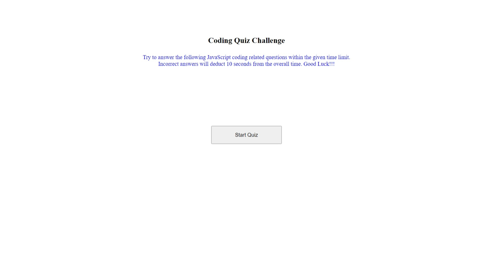
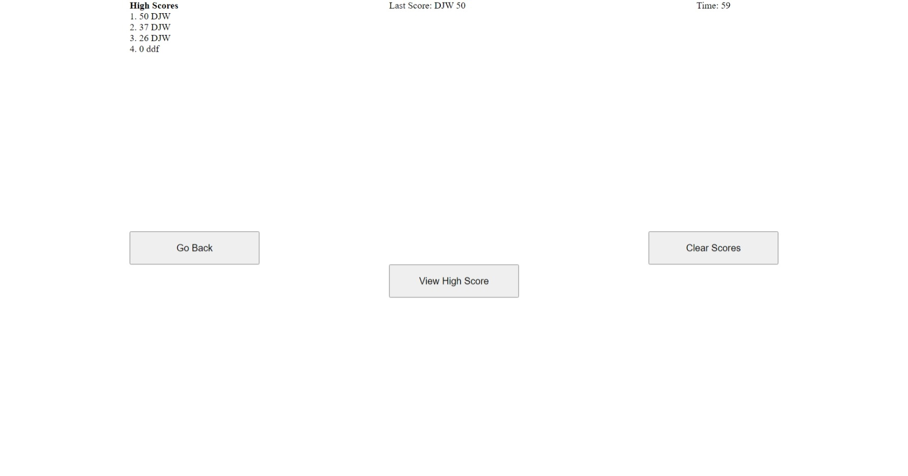

# Assignment 04:  Coding Quiz

## Description
This application is a JavaScript coding quiz.  Multiple choice questions are generated and the user has the opportunity to answer the questions.  This is a timed quiz and the user will receive a response when the answer is clicked.  Overall, the user has 75 seconds to answer 5 multiple choice questions.  The score is a calculation of time left on the clock at the time of the answer and getting the question correct.  Points are only received for correct answers.  A wrong answer will generate a reduction of 10 seconds on the quiz timer.  At the end of the quiz, the user will enter his or her initials and the score will be displayed on the screen and stored in the web browsers local storage.    

This application will be utilizing HTML, CSS, and JavaScript.  JavaScript will be used to store and generate the coding quiz questions.  The structure is made with a simple CSS grid layout.  The HTML is the basically a placeholder for the CSS and JavaScript content.

## Screenshots of webpage

## Webpage URL

[Coding_Quiz_Webpage_Live](https://djavanw.github.io/code_quiz)

## Contributor
D.J. Worthy

## License
The Unlicense

### Date
6 March 2021
